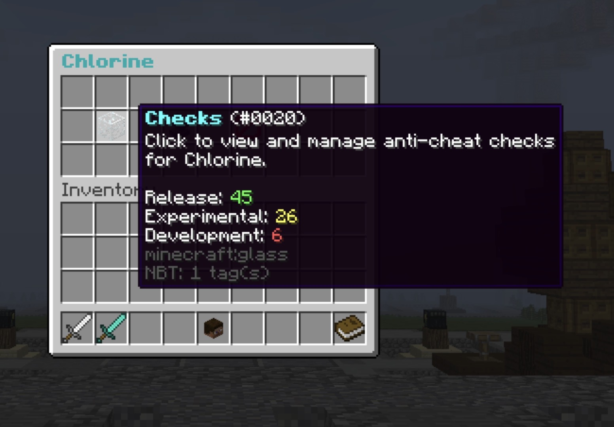
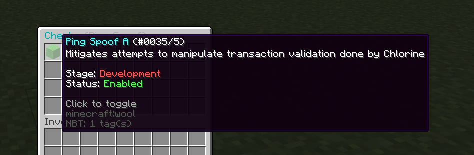
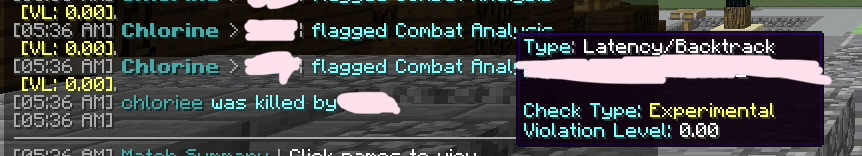

# Chlorie
Hello, I'm Chlorie (chloride + chloe). I am a software developer who is focused primarily on video game anti-cheat systems.

## Current Projects
### Chlorine
An anti-cheat software mainly targeted towards Minecraft Bukkit servers.

## Technologies
### Languages
- Java
- Lua(u)
- C

## GitHub Statistics

